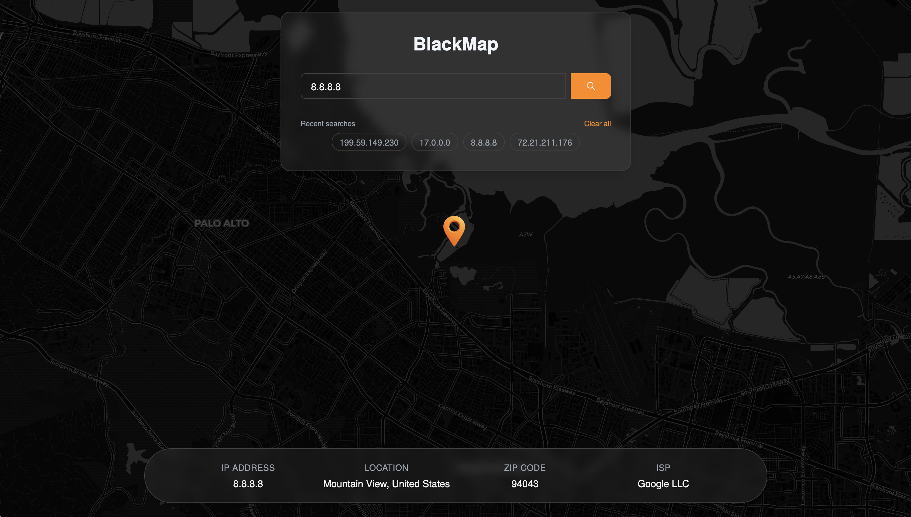

# BlackMap

BlackMaps is a sleek and modern IP tracker application designed for users who want quick and visually engaging insights into the location of any IP address. Whether you’re curious about a visitor’s location or auditing network activity, BlackMaps provides accurate geolocation data presented on a beautifully styled dark map.

## Features

- 📌 Enter any valid IP address and retrieve real-time location data within miliseconds
- 🗺️ A visually appealing, dark-themed map with subtle glassmorphism and orange highlights marks the exact geolocation of the IP
- 🫆 Get precise information about the IP's location, including city, country, city, ZIP Code and it's internet service provider
- 📱 Responsive design for all devices

## Screenshots



## Usage

- Input the IP address you want to track in the search field.
- The app queries a geolocation API (IPQuery) and fetches the related data instantly.
- The map centers on the IP’s location, and the details panel shows the associated address, city, country, zip code, and ISP.
- Zoom in/out or pan the map to view the surrounding geography.

## Getting Started

### Prerequisites

- Node.js (v18+ recommended)
- npm

### Setup

1. Clone the repository:
   ```sh
   git clone <repo-url>
   cd BlackMap
   ```
2. Install dependencies:
   ```sh
   npm install
   ```
3. Start the development server:

   ```sh
   npm run dev
   ```

   The app will be available at `http://localhost:4321`.

### Build for Production

```sh
npm run build
npm run preview
```

### Deployment

- Deploy easily to Vercel, Netlify, or any static host.

## Credits

- [Astro](https://astro.build/) (with React integration)
- [React](https://react.dev/)
- [TailwindCSS](https://tailwindcss.com/)
- [Leaflet](https://leafletjs.com/)

---

© 2025 BlackMap. Built by Mateo Filip.
